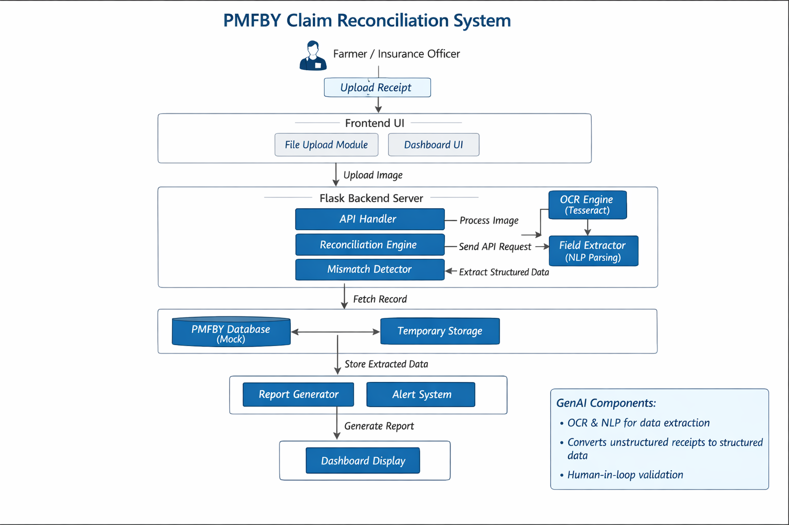

# PMFBY Claim Reconciliation Tool

## 🚨 Problem Statement

In India's **Pradhan Mantri Fasal Bima Yojana (PMFBY)** crop insurance scheme, thousands of valid farmer claims are rejected every year — not due to fraud, but due to **minor data mismatches** between:

- **Offline paper records** (fertilizer bills, handwritten entries)
- **Digital PMFBY portal entries** (entered by agents)

**Example:**
- Receipt: `Area = 0.50 ha`  
- Portal: `Area = 0.45 ha`

This small discrepancy leads to **claim rejection**, delaying or denying compensation to farmers.

> ❗ This is not a funding problem — it is a **reconciliation problem**.

---

## 💡 Solution

We built a **lightweight AI-assisted reconciliation system** that:

1. Digitizes offline receipts (OCR simulation)
2. Extracts structured data fields
3. Fetches corresponding PMFBY digital records
4. Compares all fields automatically
5. Detects mismatches with clear visual alerts
6. Generates a reconciliation report for human validation

👉 Designed as a **decision-support system**, not full automation.

---

## 🏗️ System Architecture



### 🔁 Core Flow

1. Farmer uploads receipt  
2. OCR extracts structured data (simulated)  
3. Backend fetches PMFBY record  
4. Reconciliation engine compares fields  
5. Mismatch detection logic flags discrepancies  
6. Report generated for human review  

> ⚠️ Built with a **human-in-the-loop architecture** to ensure reliability in government workflows.

---

## 🤖 Where GenAI Fits

While this is a prototype, the architecture is designed for GenAI integration:

- **OCR Engine (AI-based)** → Converts receipt images into text  
- **Field Extraction (NLP)** → Structures unorganized data  
- **Decision Support Layer** → Assists officers instead of replacing them  

> This aligns with real-world AI systems where **accuracy, auditability, and human oversight** are critical.

---

## ⚙️ Features

- 📄 Receipt ingestion (sample + upload simulation)  
- 🔍 OCR-style extraction flow  
- 🌐 Portal data retrieval (mock backend)  
- ⚖️ Automatic field-level comparison  
- 🔴 Visual mismatch highlighting  
- 📋 Reconciliation report generation  
- 🧑‍💼 Human-in-the-loop validation workflow  
- 💻 Clean dashboard UI for demonstration  

---

## 📊 Impact Model (Estimated)

| Metric                      | Before System | After System |
|---------------------------|--------------|--------------|
| Claim verification time    | ~15 minutes  | ~3 minutes   |
| Manual workload            | High         | Reduced      |
| Error detection rate       | Low          | High         |

### Assumptions:
- 10,000 claims/day (state-level)
- ~12 minutes saved per claim

👉 **Time saved/day** = ~120,000 minutes (~2000 hours)

👉 Even **1% improvement in claim approval** = significant financial recovery for farmers

> This system directly improves **efficiency, transparency, and trust** in insurance workflows.

---

## 🎬 Demo Flow

1. Click **"Use Sample Receipt"**  
2. Observe OCR simulation + extraction  
3. Compare receipt vs portal data  
4. Mismatch automatically highlighted  
5. Generate reconciliation report  

👉 Demonstrates full cycle:  
**Problem → Detection → Resolution**

---

## 🧱 Project Structure

```
project-root/
├── backend/
│   └── app.py
├── frontend/
│   └── index.html
├── architecture.png
├── requirements.txt
└── README.md
```

---

## 🔌 API Endpoints

| Method | Route              | Description                        |
|--------|--------------------|------------------------------------|
| GET    | `/`                | Serves frontend dashboard          |
| GET    | `/get_data`        | Returns mock receipt + portal data |
| POST   | `/compare`         | Runs reconciliation logic          |
| POST   | `/generate_report` | Generates audit report             |

---

## 🧪 Sample Data

```json
{
  "receipt": { "farmer": "Ravi Kumar", "area": 0.50, "crop": "Rice" },
  "portal":  { "farmer": "Ravi Kumar", "area": 0.45, "crop": "Rice" }
}
```

👉 Difference: `0.05 ha`  
👉 Threshold: `0.01 ha`  
👉 Result: **Mismatch Detected**

---

## ⚙️ Tech Stack

- **Backend**: Python + Flask  
- **Frontend**: HTML + Tailwind CSS  
- **AI Layer (Simulated)**: OCR + NLP pipeline  
- **Data**: Mock JSON  
- **Deployment**: Localhost  

---

## ▶️ How to Run

### Backend

```bash
cd backend
pip install -r requirements.txt
python app.py
```

### Frontend

Open:
```
frontend/index.html
```

Then go to:
```
http://127.0.0.1:5000
```

---

## 🔐 Design Philosophy

- AI **assists**, not replaces humans  
- Built for **real-world workflows**  
- Focus on **accuracy, transparency, auditability**  
- Designed for **scalability**

---

## 🏁 Conclusion

This project demonstrates how **AI-assisted reconciliation systems** can solve real-world inefficiencies in public infrastructure.

> From offline chaos to structured clarity — enabling farmers to receive what they rightfully deserve.

---

**Built for ET GenAI Hackathon**  
**Team: Delution Tech**
